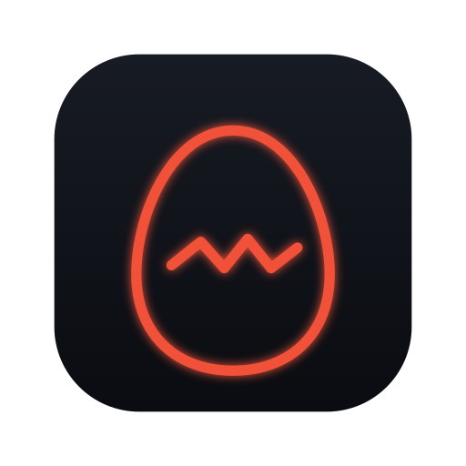

<div align="center">



# PokeTokenBar for Windows

**AI agent token usage로 포켓몬을 키워 봅시다.**


</div>

> 이 저장소는 Swift와 AppKit으로 작성된 macOS용
> [원본 PokeTokenBar](https://github.com/chattymin/PokeTokenBar)를 Windows 전용으로
> 포팅하는 프로젝트입니다. 현재 Windows 앱은 C#/.NET과 WPF로 독립 구현되어 있습니다.

PokeTokenBar는 로컬에 저장된 AI 코딩 도구의 사용량을 읽어 오늘·이번 주·이번 달
토큰을 집계합니다. 새로 사용한 토큰은 포켓몬 알의 부화와 성장에 반영되며,
진화·도감·상점·가방 진행 상황은 Windows 사용자 데이터 폴더에 저장됩니다.


## Details

- Windows 알림 영역(시스템 트레이) 아이콘과 WPF 팝업
- 좌측 상단 제목에서 현재 설치 버전 확인
- Claude Code, Codex, Gemini CLI(레거시), Antigravity, OpenCode, Hermes Agent, Cursor, Grok CLI, Copilot CLI, Kiro CLI, Pi Agent, omp 로컬 사용량 집계
- Codex SSH 원격 세션 사용량 집계 · `~/.ssh/config`의 호스트 별칭 자동 발견 및 선택
- 오늘·이번 주·이번 달 토큰 표시와 자동/수동 새로고침
- Codex·Claude Code·Antigravity 공식 5시간·주간 사용량 한도와 reset countdown 표시
  (각 도구의 로컬 실행 파일 또는 OAuth 자격증명이 Windows에 있는 경우)
- Antigravity Desktop 실행 중에는 로컬 language server를 통해 공식 한도를 조회하며 OAuth 비밀값은 읽지 않음
- 홈·상점·가방·컬렉션 탐색과 밝은 팝업 화면, 별도 사용량 상세·설정 버튼
- 사용량 상세(TOKENS): 기간별 공급자 합계·비율, 모델별 토큰·비율과 오늘의 Input / Output / Cache 상세
- 홈의 성격·희귀도·진화 단계 표시와 확정 경로의 진화 스프라이트 미리보기(분기는 숨김)
- 알 부화, 실제 진화 계보 기반 성장, 분기 진화, 성격과 색이 다른 포켓몬 여부
- 분기 진화는 미수집 최종 형태를 우선 후보로 자동 선택 · 확정된 계획은 재시작 후에도 유지
- 육성 완료한 계열의 부화 가중치 감소 · 새로 부화한 재육성 개체는 성장 ×2
- 성장·상점 가격 난이도를 각각 10%–200%로 조절 · 저장 시 현재 성장 진행률 유지
- 일반 등급의 진화 가능한 포켓몬 부화 시 1/128 확률로 메타몽 위장 · 첫 진화 시점에 정체 공개
- 1–9세대 포켓몬 1,025종과 일반·이로치 도트 이미지 2,050장 내장 · 이름/번호 검색, 희귀도/이로치 필터, 정렬과 도감 페이지 이동
- 수집한 대표 포켓몬을 트레이·플로팅 펫에 고정 · 홈과 성장은 현재 육성 대상을 계속 표시
- 부화·1진화·2진화 애니메이션 및 Windows 트레이 알림
- 클릭으로 본창을 열고 닫을 수 있는 드래그 가능한 플로팅 펫
- 단일 실행 인스턴스와 사용자별 데이터·캐시·로그 저장
- 설정에서 새 버전 확인과 한 번 클릭하는 간편 업데이트 · 다운로드 검증, 진행 백업, 정상 종료 후 설치·재실행

처음 발견한 각 공급자의 누적 사용량은 기준값으로만 저장됩니다. 설치 전에 사용한
토큰을 소급해 성장시키지 않으며, 그 뒤에 새로 증가한 토큰부터 포켓몬에게 반영됩니다.

TOKENS의 TODAY는 Input / Output / Cache(쓰기·읽기)를 나누어 표시하며,
WEEK와 MONTH는 공급자별 합계와 비율을 표시합니다. 모든 기간에서 로컬 기록에
남은 모델별 토큰과 공급자 내 비율을 함께 표시하며, 모델명이 없으면 ‘모델 정보 없음’으로 표시합니다. 선택 기간의 사용량이 0인
공급자는 숨깁니다. HOME은 오늘 전체 합계와 포켓몬 성장을 보여 줍니다.


## Token usage가 계산되는 agent 목록

| 도구 | 기본 검색 위치 | 형식 |
| --- | --- | --- |
| Codex | `%USERPROFILE%\.codex\sessions`, `archived_sessions` | JSONL |
| Codex (원격) | 선택한 SSH 호스트의 `~/.codex/sessions`, `archived_sessions` | SSH 증분 동기화 |
| Gemini CLI (레거시) | `%USERPROFILE%\.gemini\tmp` | JSON / JSONL |
| Antigravity CLI / IDE | `%USERPROFILE%\.gemini\antigravity*\conversations` | SQLite / protobuf |
| Cursor | `%APPDATA%\Cursor\User\globalStorage` 및 Nightly 경로 | SQLite |
| GitHub Copilot CLI | `%USERPROFILE%\.copilot` 또는 `COPILOT_HOME` | SQLite |
| Claude Code | `%USERPROFILE%\.claude\projects`, `.config\claude\projects` | JSONL |
| OpenCode | `%USERPROFILE%\.local\share\opencode` | SQLite / JSON |
| Hermes Agent | `%USERPROFILE%\.hermes\state.db` | SQLite |
| Grok CLI | `%USERPROFILE%\.grok\sessions` | JSONL |
| Kiro CLI (추정) | `%USERPROFILE%\.kiro\sessions`, `.local\share\kiro-cli`, `%APPDATA%\kiro-cli` | SQLite / JSONL |
| Pi Agent | `%USERPROFILE%\.pi\agent\sessions` | JSONL |
| omp | `%USERPROFILE%\.omp\agent\sessions` | JSONL |

위 목록은 **로컬 도구의 기록** 지원 목록이며, Claude/Grok 웹사이트나 모바일 앱의
대화 사용량은 포함하지 않습니다. Gemini CLI의 기존 로컬 기록 지원은 유지합니다.

원격 Codex는 Windows OpenSSH로 비대화형 접속할 수 있고 원격 호스트에 `python3`가
설치되어 있어야 합니다. 앱의 **설정 → 원격 Codex SSH**에서 `~/.ssh/config`로부터 자동
발견된 구체적인 호스트 별칭 중 집계할 호스트를 선택하면 됩니다. 프롬프트나 응답 본문은 복사하지 않고 세션 ID, 모델,
토큰 사용량 메타데이터만 로컬 캐시에 증분 저장합니다.

SSH 호스트 자동 발견은 모든 로컬 AI 도구에 공통으로 쓸 수 있지만, 원격 기록의 위치와
형식은 도구마다 다릅니다. 현재 원격 집계기는 Codex 세션만 지원합니다.

Kiro CLI는 원본과 같이 텍스트의 UTF-8 바이트 길이를 이용한 **추정치**이며, 실제
토큰 사용량과 다를 수 있습니다. 추정치도 전체 합계와 포켓몬 성장에 반영됩니다.
나머지 공급자는 기록에 있는 토큰 메타데이터를 집계합니다. Kiro 추정 과정에서는
대화 텍스트를 로컬에서 읽지만, 대화 원문을 별도로 저장하거나 외부로 전송하지 않습니다.

추가 검색 경로, 집계 방식과 검증 범위는 [로컬 공급자 참고](docs/reference/local-providers.md)를
참고하세요. 새 공급자 7종은 샘플 기록으로 검증했으며, 각 도구의 실제 사용 검증은 남아 있습니다.


## 설치

### 요구 사항

- Windows 10 이상, x64

### How to...

[최신 릴리스 다운로드](https://github.com/rowlet9g/PokeTokenBar-Windows/releases/latest)


## 데이터와 네트워크

- 사용자 데이터: `%USERPROFILE%\.poketokenbar` (v0.5.2부터 실행 환경과 관계없이 공유)
- 기존 `%LOCALAPPDATA%\PokeTokenBar` 데이터는 첫 실행 시 자동 복사하며 원본을 보존합니다. 이전에 실패하면 진행을 초기화하지 않고 실행을 중단합니다.
- 설치 위치: `%LOCALAPPDATA%\Programs\PokeTokenBar`
- 포켓몬 종·진화 정보: [PokéAPI](https://pokeapi.co/)의 1–9세대 데이터 스냅샷을 앱에 내장
- 포켓몬 스프라이트: 고정된 [PokeAPI sprites 버전](https://github.com/PokeAPI/sprites/tree/8491ffde1b247e4de574d4bb8e24b7bd9fa876fa)의 일반·이로치 도트 이미지 내장
- 업데이트: 이 저장소의 공개 GitHub Releases를 조회하고 설치 파일의 크기·버전·SHA-256을 검증

v1.0.0부터 포켓몬 정보와 이미지는 인터넷 없이도 사용할 수 있습니다. 6세대 이후의
도트에는 커뮤니티에서 제작한 5세대 스타일 이미지가 포함됩니다. 지역별 모습·메가진화 등
별도 폼 전체를 지원한다는 뜻은 아닙니다. 기존 육성 개체의 진화 경로와 성장 기준은
유지하며, 새로 부화한 개체부터 확장된 진화 계보를 사용합니다.

설치 버전은 **설정 → 앱 업데이트**에서 새 버전 버튼을 한 번 누르면 다운로드 후
진행을 저장하고 정상 종료하여 기존 위치에 설치한 뒤 자동으로 다시 실행합니다.
설치 직전 세이브와 설정은 데이터 폴더의 `UpdateBackups`에도 백업합니다.
v0.7.0 이하에서는 v1.0.0 설치 파일을 한 번 직접 설치해야 이 기능을 사용할 수 있습니다.
Portable ZIP은 간편 설치 업데이트 대상에서 제외됩니다.

토큰 사용량, 프롬프트, 응답 내용 및 프로젝트 경로는 PokéAPI나 GitHub 업데이트
요청으로 전송하지 않습니다.


## 프로젝트 구조

```text
Windows/
├─ src/PokeTokenBar.Core/              # 사용량·포켓몬·저장 로직
├─ src/PokeTokenBar.Platform.Windows/   # 트레이·SQLite·시작프로그램 등 Windows 연동
└─ src/PokeTokenBar.Windows/            # WPF 애플리케이션과 화면
```

자세한 Windows 구현 내용은 [`Windows/README.md`](Windows/README.md), 기능별 진행
상태는 [`Windows/PORTING_STATUS.md`](Windows/PORTING_STATUS.md)에서 확인할 수 있습니다.


## LICENSE

이 포팅은 [chattymin/PokeTokenBar](https://github.com/chattymin/PokeTokenBar)를
기반으로 합니다. 원작과 이 저장소의 자체 소스 코드는 [`LICENSE`](LICENSE)의 MIT
라이선스를 따릅니다.

PokeTokenBar는 비공식·비상업적 팬 프로젝트이며 Nintendo, Game Freak, Creatures Inc.
또는 The Pokémon Company와 제휴·후원·승인 관계가 없습니다. Pokémon 관련 명칭,
캐릭터, 이미지 및 데이터의 권리는 각 권리자에게 있습니다.
스프라이트 출처와 원본 라이선스 고지는 배포 파일의 `ThirdParty` 폴더와
[`Windows/src/PokeTokenBar.Core/Data`](Windows/src/PokeTokenBar.Core/Data)에 포함합니다.
